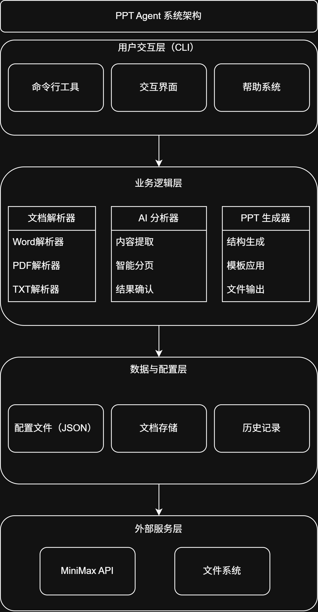

# PPT Agent 技术设计文档

## 文档信息

| 属性 | 内容 |
|------|------|
| 产品名称 | PPT Agent |
| 文档版本 | v1.0 |
| 文档日期 | 2026-05-08 |
| 文档作者 | 产品研发团队 |

---

## 1. 技术架构概述

### 1.1 系统架构图



### 1.2 技术栈汇总

| 层次 | 技术选型 | 说明 |
|------|----------|------|
| 用户交互 | CLI (命令行) | V1.0 版本采用，后续可扩展 GUI |
| 开发语言 | Python | 主开发语言 |
| AI 框架 | LangChain | 用于构建 AI 应用 |
| AI 模型 | MiniMax API | Anthropic 兼容接口 |
| PPT 生成 | python-pptx | 生成 .pptx 文件 |
| 配置管理 | JSON | 配置文件存储 |
| 日志系统 | Python logging | 详细日志记录 |
| 项目管理 | 单仓库 | 所有模块在同一仓库 |

---

## 2. 项目结构设计

### 2.1 目录结构

```
PPT_Agent/
├── App/                          # 核心应用模块（扁平化结构）
│   ├── __init__.py
│   ├── main.py                   # 程序入口
│   ├── cli.py                    # 命令行交互
│   ├── parser.py                 # 文档解析
│   ├── analyzer.py               # AI 分析
│   ├── generator.py              # PPT 生成
│   ├── client.py                 # API 客户端
│   └── config.py                 # 配置管理
├── Utils/                        # 工具模块
│   ├── __init__.py
│   └── logger.py                 # 日志工具
├── Templates/                    # PPT 模板目录
│   └── blank.pptx                # 空白模板
├── Config/                       # 配置文件目录
│   └── config.json               # 应用配置
├── output/                       # 输出目录
│   └── history/                  # 历史记录目录
├── docs/                         # 文档目录
├── README.md                     # 项目说明
├── .python-version               # Python 版本指定
├── pyproject.toml               # 项目配置
├── uv.lock                      # 依赖锁定文件
└── CHANGELOG.md                 # 更新日志
```

**设计原则**：
- 采用扁平化结构，减少目录层级
- 将功能相近的代码合并到单个文件中
- 便于快速开发和调试

### 2.2 模块职责说明

#### 2.2.1 App.parser - 文档解析模块

**职责**：解析用户上传的文档，提取文字和表格内容

**支持格式**：.txt, .docx, .doc, .pdf

**接口设计**：
```python
class BaseParser:
    """解析器基类"""
    def parse(self, file_path: str) -> DocumentContent:
        """解析文档并返回内容"""
        pass

    def validate(self, file_path: str) -> bool:
        """验证文件格式是否支持"""
        pass

class ParserFactory:
    """解析器工厂"""
    @staticmethod
    def get_parser(file_path: str) -> BaseParser:
        """根据文件类型返回对应的解析器"""
        pass
```

#### 2.2.2 App.analyzer - AI 分析模块

**职责**：调用 AI 模型分析文档内容，生成 PPT 结构

**接口设计**：
```python
class AIAnalyzer:
    """AI 分析器"""
    def __init__(self, client: MiniMaxClient):
        self.client = client

    def analyze(self, content: DocumentContent) -> AnalysisResult:
        """分析文档内容并返回 PPT 结构"""
        pass

    def confirm_result(self, result: AnalysisResult) -> bool:
        """等待用户确认分析结果"""
        pass
```

#### 2.2.3 App.generator - PPT 生成模块

**职责**：根据 AI 分析结果生成 PPT 文件

**接口设计**：
```python
class PPTGenerator:
    """PPT 生成器"""
    def __init__(self, template_dir: str = "Templates"):
        self.template_dir = template_dir

    def generate(self, result: AnalysisResult, template: str = "blank") -> str:
        """生成 PPT 文件并返回保存路径"""
        pass

    def list_templates(self) -> List[str]:
        """列出所有可用模板"""
        pass
```

#### 2.2.4 App.client - API 调用模块

**职责**：封装 MiniMax API 调用，包含重试和错误处理

**接口设计**：
```python
class MiniMaxClient:
    """MiniMax API 客户端"""
    def __init__(self):
        self.config = load_api_config()

    def chat(self, messages: List[Message]) -> str:
        """发送聊天请求，自动处理重试和错误"""
        pass

    def analyze_document(self, content: str) -> dict:
        """分析文档并返回结构化结果"""
        pass
```

#### 2.2.5 App.config - 配置管理模块

**职责**：管理 JSON 配置文件，从环境变量读取敏感信息

**接口设计**：
```python
class Config:
    """配置类"""
    @staticmethod
    def load(config_path: str = "Config/config.json") -> dict:
        """加载配置文件"""
        pass

    @staticmethod
    def get_api_key() -> str:
        """从环境变量获取 API Key"""
        pass
```

#### 2.2.6 Utils - 工具模块

**职责**：提供通用的工具函数

**子模块**：
- `logger.py`：日志配置和管理

---

## 3. 数据模型设计

### 3.1 核心数据模型

#### 3.1.1 DocumentContent - 文档内容

```python
@dataclass
class DocumentContent:
    """解析后的文档内容"""
    raw_text: str                          # 原始文本
    tables: List[TableData]                # 表格列表
    metadata: DocumentMetadata              # 元数据

@dataclass
class TableData:
    """表格数据"""
    headers: List[str]                     # 表头
    rows: List[List[str]]                   # 数据行

@dataclass
class DocumentMetadata:
    """文档元数据"""
    file_name: str                          # 文件名
    file_type: str                          # 文件类型
    file_size: int                          # 文件大小
```

#### 3.1.2 AnalysisResult - AI 分析结果

```python
@dataclass
class AnalysisResult:
    """AI 分析结果"""
    title: str                              # PPT 标题
    slides: List[SlideContent]              # 幻灯片内容列表
    summary: str                            # 总结
    notes: Optional[str] = None             # 演讲者备注

@dataclass
class SlideContent:
    """单页幻灯片内容"""
    slide_number: int                       # 幻灯片编号
    title: str                              # 页面标题
    bullet_points: List[str]                # 要点列表
```

### 3.2 数据流图

```
用户输入文档
      │
      ▼
┌──────────────┐
│  文档解析    │ ──► DocumentContent
└──────────────┘
      │
      ▼
┌──────────────┐
│  AI 分析    │ ──► AnalysisResult
└──────────────┘
      │
      ▼ (用户确认)
┌──────────────┐
│  结果确认    │
└──────────────┘
      │
      ▼
┌──────────────┐
│  PPT 生成    │ ──► .pptx 文件
└──────────────┘
      │
      ▼
┌──────────────┐
│  保存历史    │
└──────────────┘
```

---

## 4. 核心模块详细设计

### 4.1 文档解析器设计

#### 4.1.1 解析器工厂模式

```python
class ParserFactory:
    @staticmethod
    def get_parser(file_path: str) -> BaseParser:
        """根据文件类型返回对应的解析器"""
        extension = Path(file_path).suffix.lower()

        parsers = {
            '.txt': TxtParser,
            '.docx': WordParser,
            '.doc': WordParser,
            '.pdf': PdfParser
        }

        parser_class = parsers.get(extension)
        if not parser_class:
            raise UnsupportedFormatError(f"不支持的文件格式: {extension}")

        return parser_class()
```

#### 4.1.2 支持的文件格式

| 格式 | 解析器 | 支持内容 | 备注 |
|------|--------|----------|------|
| .txt | TxtParser | 纯文本 | 无限制 |
| .docx | WordParser | 文字、表格 | 使用 python-docx |
| .doc | WordParser | 文字、表格 | 兼容旧格式 |
| .pdf | PdfParser | 文字、表格 | 暂不支持扫描版 |

#### 4.1.3 解析流程

```python
def parse_document(file_path: str) -> DocumentContent:
    parser = ParserFactory.get_parser(file_path)

    if not parser.validate(file_path):
        raise ValidationError("文件格式验证失败")

    content = parser.parse(file_path)

    return content
```

### 4.2 AI 分析器设计

#### 4.2.1 分析流程

```
文档内容
   │
   ▼
┌────────────────┐
│ 构建提示词     │ ◄── 从 prompt_templates.py 获取模板
└────────────────┘
   │
   ▼
┌────────────────┐
│ 调用 MiniMax   │ ◄── 使用 MiniMaxClient.chat()
└────────────────┘
   │
   ▼
┌────────────────┐
│ 解析响应       │ ◄── JSON 格式返回
└────────────────┘
   │
   ▼
┌────────────────┐
│ 验证结果       │ ◄── 使用 result_validator.py
└────────────────┘
   │
   ▼
┌────────────────┐
│ 返回 AnalysisResult │
└────────────────┘
```

#### 4.2.2 提示词模板

```python
SYSTEM_PROMPT = """你是一个专业的 PPT 内容规划助手。
你的任务是根据用户提供的文档内容，生成结构化的 PPT 大纲。

要求：
1. 提取文档的核心主题和关键信息
2. 合理分页，确保每页内容聚焦
3. 每页内容简洁明了，适合演讲展示
4. 所有内容必须来源于用户提供的文档，不要自行发挥

输出格式（JSON）：
{
    "title": "PPT标题",
    "slides": [
        {
            "slide_number": 1,
            "title": "页面标题",
            "bullet_points": ["要点1", "要点2", ...],
            "notes": "演讲者备注（可选）"
        },
        ...
    ],
    "outline": "整体大纲描述",
    "summary": "总结"
}"""

USER_PROMPT_TEMPLATE = """请分析以下文档内容并生成 PPT 结构：

{content}

请严格按照 JSON 格式输出，不要添加其他内容。"""
```

#### 4.2.3 结果验证

```python
class ResultValidator:
    def validate(self, result: dict) -> bool:
        """验证 AI 返回结果的有效性"""
        required_fields = ['title', 'slides', 'outline', 'summary']

        for field in required_fields:
            if field not in result:
                return False

        if not isinstance(result['slides'], list):
            return False

        for slide in result['slides']:
            if not self._validate_slide(slide):
                return False

        return True

    def _validate_slide(self, slide: dict) -> bool:
        required = ['slide_number', 'title', 'bullet_points']
        return all(field in slide for field in required)
```

### 4.3 PPT 生成器设计

#### 4.3.1 生成流程

```python
def generate_ppt(analysis_result: AnalysisResult, config: PPTGenerationConfig) -> str:
    prs = Presentation()

    for slide_content in analysis_result.slides:
        slide = prs.slides.add_slide(prs.slide_layouts[6])

        title = slide.shapes.title
        title.text = slide_content.title

        body = slide.placeholders[1]
        text_frame = body.text_frame

        for i, point in enumerate(slide_content.bullet_points):
            if i == 0:
                text_frame.text = point
            else:
                p = text_frame.add_paragraph()
                p.text = point

        if slide_content.notes:
            notes_slide = slide.notes_slide
            notes_slide.notes_text_frame.text = slide_content.notes

    output_path = f"output/{analysis_result.title}.pptx"
    prs.save(output_path)

    return output_path
```

#### 4.3.2 模板管理

```python
class TemplateManager:
    def __init__(self, template_dir: str = "Templates"):
        self.template_dir = Path(template_dir)
        self._templates = self._load_templates()

    def list_templates(self) -> List[str]:
        """列出所有可用模板"""
        return list(self._templates.keys())

    def get_template_path(self, name: str) -> str:
        """获取模板文件路径"""
        if name not in self._templates:
            raise TemplateNotFoundError(f"模板不存在: {name}")
        return str(self._templates[name])

    def _load_templates(self) -> Dict[str, Path]:
        """加载所有模板文件"""
        templates = {}
        for pptx_file in self.template_dir.glob("*.pptx"):
            templates[pptx_file.stem] = pptx_file
        return templates
```

### 4.4 MiniMax API 模块设计

#### 4.4.1 重试机制

```python
class RetryHandler:
    def __init__(self, max_attempts: int = 3, backoff_factor: float = 2):
        self.max_attempts = max_attempts
        self.backoff_factor = backoff_factor

    def execute_with_retry(self, func: Callable) -> Any:
        """执行函数并在失败时重试"""
        last_exception = None

        for attempt in range(self.max_attempts):
            try:
                return func()
            except (APIError, NetworkError, TimeoutError) as e:
                last_exception = e
                if attempt < self.max_attempts - 1:
                    wait_time = self.backoff_factor ** attempt
                    logger.warning(f"API 调用失败，{wait_time}秒后重试...")
                    time.sleep(wait_time)

        raise MaxRetriesExceededError(f"超过最大重试次数: {self.max_attempts}") from last_exception
```

#### 4.4.2 错误类型定义

```python
class APIError(Exception):
    """API 调用基础异常"""
    pass

class APIResponseError(APIError):
    """API 返回错误响应"""
    pass

class NetworkError(APIError):
    """网络错误"""
    pass

class TimeoutError(APIError):
    """请求超时"""
    pass

class MaxRetriesExceededError(APIError):
    """超过最大重试次数"""
    pass
```

#### 4.4.3 客户端调用示例

```python
class MiniMaxClient:
    def __init__(self, config: APIConfig):
        self.config = config
        self.retry_handler = RetryHandler(
            max_attempts=config.retry.max_attempts,
            backoff_factor=config.retry.backoff_factor
        )

    def chat(self, messages: List[Message]) -> str:
        def call_api():
            response = self._client.messages.create(
                model=self.config.model,
                messages=messages,
                max_tokens=self.config.max_tokens
            )
            return response.content[0].text

        return self.retry_handler.execute_with_retry(call_api)
```

---

## 5. 配置管理设计

### 5.1 配置加载器

```python
class ConfigLoader:
    def __init__(self, config_dir: str = "Config"):
        self.config_dir = Path(config_dir)

    def load_app_config(self) -> AppConfig:
        config_path = self.config_dir / "app_config.json"
        with open(config_path, 'r', encoding='utf-8') as f:
            data = json.load(f)
        return AppConfig(**data)

    def load_api_config(self) -> APIConfig:
        config_path = self.config_dir / "api_config.json"
        with open(config_path, 'r', encoding='utf-8') as f:
            data = json.load(f)

        data['api_key'] = os.getenv('MINIMAX_API_KEY', data.get('api_key', ''))

        return APIConfig(**data)

    def save_config(self, config: dict, config_name: str) -> None:
        config_path = self.config_dir / f"{config_name}.json"
        with open(config_path, 'w', encoding='utf-8') as f:
            json.dump(config, f, indent=4, ensure_ascii=False)
```

### 5.2 配置文件结构

#### app_config.json

```json
{
  "app": {
    "name": "PPT Agent",
    "version": "1.0.0",
    "default_template": "blank",
    "output_dir": "output",
    "history_dir": "output/history",
    "max_history_count": 100
  },
  "logging": {
    "level": "DEBUG",
    "file": "logs/app.log",
    "format": "%(asctime)s - %(name)s - %(levelname)s - %(message)s",
    "max_file_size_mb": 10,
    "backup_count": 5
  },
  "document": {
    "supported_formats": [".txt", ".docx", ".doc", ".pdf"],
    "max_file_size_mb": 50
  }
}
```

#### api_config.json

```json
{
  "api": {
    "provider": "minimax",
    "base_url": "https://api.minimaxi.com/anthropic",
    "model": "MiniMax-M2.7",
    "max_tokens": 4096,
    "timeout": 60,
    "retry": {
      "max_attempts": 3,
      "backoff_factor": 2
    }
  }
}
```

---

## 6. 日志系统设计

### 6.1 日志配置

```python
def setup_logger(name: str, log_file: str, level: str = "DEBUG") -> logging.Logger:
    logger = logging.getLogger(name)
    logger.setLevel(getattr(logging, level.upper()))

    formatter = logging.Formatter(
        '%(asctime)s - %(name)s - %(levelname)s - [%(filename)s:%(lineno)d] - %(message)s'
    )

    file_handler = logging.FileHandler(log_file, encoding='utf-8')
    file_handler.setLevel(logging.DEBUG)
    file_handler.setFormatter(formatter)

    logger.addHandler(file_handler)

    return logger
```

### 6.2 日志级别使用规范

| 级别 | 使用场景 |
|------|----------|
| DEBUG | 详细的调试信息（API 请求/响应、变量值） |
| INFO | 正常的业务流程（开始解析、开始生成） |
| WARNING | 警告但不影响功能（配置缺失、使用默认值） |
| ERROR | 错误但可恢复（API 重试、文件读取失败） |
| CRITICAL | 严重错误导致功能不可用 |

### 6.3 日志记录示例

```python
logger.debug(f"开始解析文件: {file_path}")
logger.debug(f"文件大小: {file_size} bytes")

try:
    content = parser.parse(file_path)
    logger.info(f"文档解析成功，共 {len(content.paragraphs)} 个段落")
except Exception as e:
    logger.error(f"文档解析失败: {str(e)}", exc_info=True)
```

---

## 7. 命令行界面设计

### 7.1 命令结构

```
ppt-agent [命令] [选项]

命令：
  generate    从文档生成 PPT
  templates   列出可用模板
  history     查看生成历史
  config      配置管理
  help        显示帮助信息

选项：
  -i, --input     输入文件路径
  -o, --output    输出目录
  -t, --template  指定模板
  -v, --verbose   显示详细日志
```

### 7.2 主要命令

#### generate 命令

```bash
ppt-agent generate -i document.docx -t business

选项：
  -i, --input <path>     必需，输入文件路径
  -t, --template <name>  可选，模板名称（默认：blank）
  -o, --output <dir>    可选，输出目录（默认：output）
```

#### templates 命令

```bash
ppt-agent templates

输出：
  可用模板：
    1. blank - 空白模板（默认）
    2. business - 商务风格
    3. academic - 学术风格
    ...
```

#### history 命令

```bash
ppt-agent history

输出：
  生成历史：
    1. 2026-05-08 10:30 - project_proposal.pptx
    2. 2026-05-07 15:20 - meeting_notes.pptx
    ...
```

### 7.3 交互流程

```
$ ppt-agent generate -i input.docx

开始分析文档...
[1/4] 文档解析完成 ✓

AI 正在分析内容...
[2/4] 内容分析完成 ✓

请确认以下 PPT 结构：

标题：项目提案
页数：5

页面 1：项目概述
  - 项目背景
  - 项目目标

页面 2：技术方案
  - 技术选型
  - 架构设计

...

是否确认生成 PPT？ (y/n): y

正在生成 PPT...
[3/4] PPT 生成中...
[4/4] 生成完成 ✓

PPT 已保存至：output/project_proposal.pptx
```

---

## 8. 测试策略

### 8.1 测试框架选择

- **单元测试**：pytest
- **测试覆盖**：核心模块（解析器、分析器、生成器）

### 8.2 测试目录结构

```
tests/
├── __init__.py
├── unit/                          # 单元测试
│   ├── test_document_parser.py
│   ├── test_ai_analyzer.py
│   ├── test_ppt_generator.py
│   ├── test_config_manager.py
│   └── test_utils.py
├── integration/                   # 集成测试
│   └── test_end_to_end.py
└── fixtures/                     # 测试数据
    ├── sample.txt
    ├── sample.docx
    └── sample.pdf
```

### 8.3 测试用例示例

```python
# tests/unit/test_document_parser.py
import pytest
from App.DocumentParser import TxtParser, WordParser, PdfParser

class TestTxtParser:
    def test_parse_simple_text(self):
        parser = TxtParser()
        content = parser.parse("tests/fixtures/sample.txt")
        assert content.raw_text is not None
        assert len(content.paragraphs) > 0

    def test_validate_format(self):
        parser = TxtParser()
        assert parser.validate("test.txt") == True
        assert parser.validate("test.pdf") == False

class TestWordParser:
    def test_parse_with_tables(self):
        parser = WordParser()
        content = parser.parse("tests/fixtures/sample.docx")
        assert len(content.tables) > 0
```

### 8.4 测试覆盖率目标

| 模块 | 目标覆盖率 |
|------|-----------|
| DocumentParser | 80%+ |
| AIAnalyzer | 70%+ |
| PPTGenerator | 80%+ |
| ConfigManager | 90%+ |

---

## 9. 错误处理设计

### 9.1 错误分类

| 错误类型 | 说明 | 处理方式 |
|----------|------|----------|
| ValidationError | 输入验证失败 | 提示用户检查输入 |
| UnsupportedFormatError | 不支持的文件格式 | 列出支持格式 |
| ParseError | 文档解析失败 | 提供详细错误信息 |
| APIError | AI API 调用失败 | 自动重试，记录日志 |
| GenerationError | PPT 生成失败 | 保存中间状态供调试 |

### 9.2 错误码定义

```python
class ErrorCode:
    SUCCESS = 0
    VALIDATION_ERROR = 1001
    UNSUPPORTED_FORMAT = 1002
    PARSE_ERROR = 2001
    API_ERROR = 3001
    NETWORK_ERROR = 3002
    TIMEOUT_ERROR = 3003
    GENERATION_ERROR = 4001
    FILE_WRITE_ERROR = 4002
```

---

## 10. 文件结构

```
PPT_Agent/
├── App/
│   ├── __init__.py
│   ├── main.py
│   ├── cli.py
│   ├── DocumentParser/
│   ├── AIAnalyzer/
│   ├── PPTGenerator/
│   ├── MiniMaxAPI/
│   └── ConfigManager/
├── Utils/
├── Templates/
├── Config/
├── output/
└── docs/
```

---

## 11. 附录

### 12.1 关键技术点说明

#### 12.1.1 为什么选择 LangChain？

- 提供统一的工具调用接口
- 支持提示词模板管理
- 内置链式调用（Chain）功能
- 方便后续扩展其他 AI 模型

#### 12.1.2 为什么使用 python-pptx？

- 纯 Python 实现，依赖简单
- 功能完整，支持大部分 PPT 特性
- 活跃的社区支持
- 易于扩展和定制

#### 12.1.3 本地运行的优势

- 无需网络即可使用（除 AI 调用）
- 保护用户隐私
- 无服务器运维成本
- 适合个人开发者和小型团队

### 12.2 后续扩展方向

1. **GUI 界面**：使用 PyQt 或 Electron 开发图形界面
2. **更多 AI 模型**：支持 OpenAI、Claude 等
3. **协作功能**：多用户协作、云端存储
4. **高级功能**：图片插入、动画效果、实时生成

---

## 13. 变更记录

| 版本 | 日期 | 变更内容 | 作者 |
|------|------|----------|------|
| 1.0 | 2026-05-08 | 初始版本 | WoodQin |
| 1.1 | 2026-05-28 | 删去 3.1 核心数据模型 中的冗余内容 | WoodQin |
